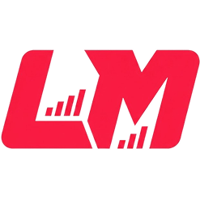
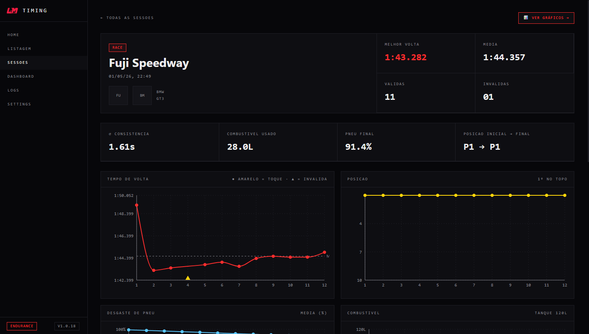
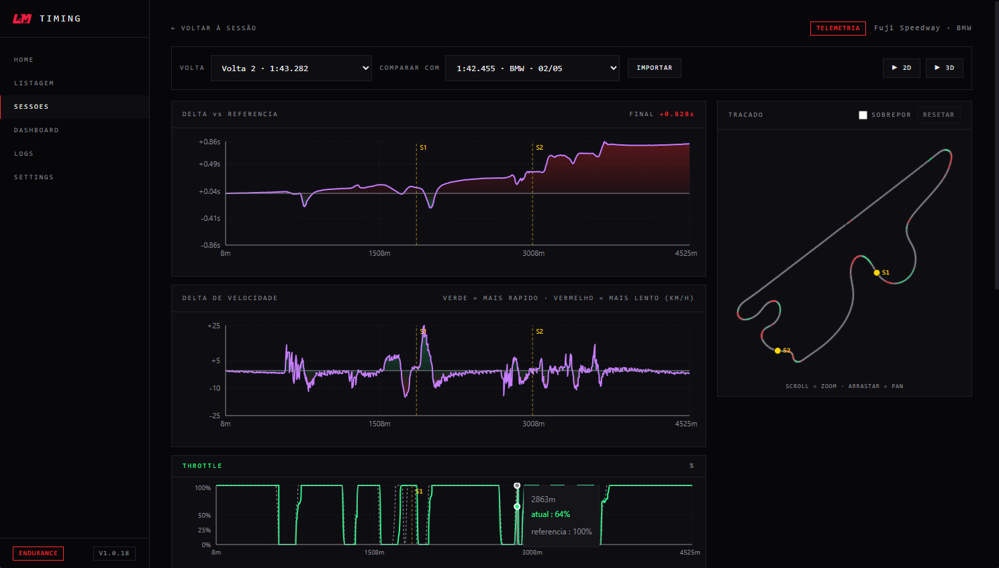
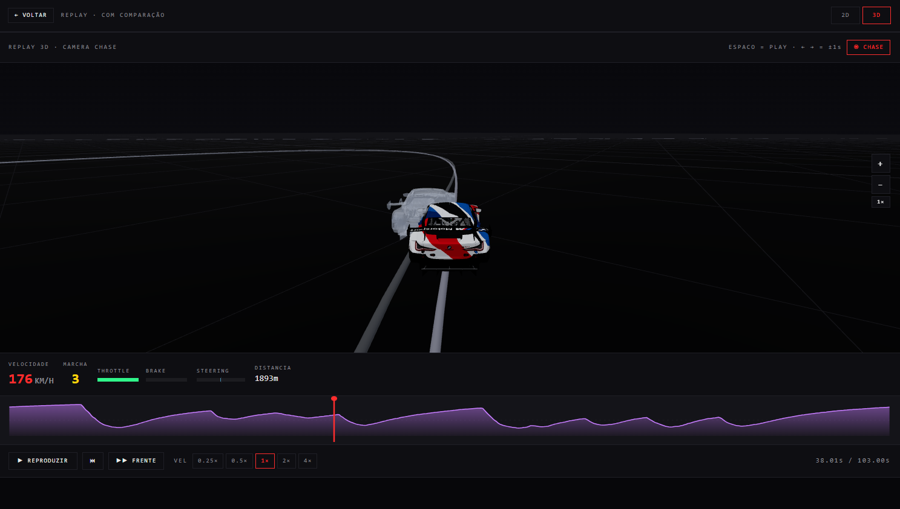
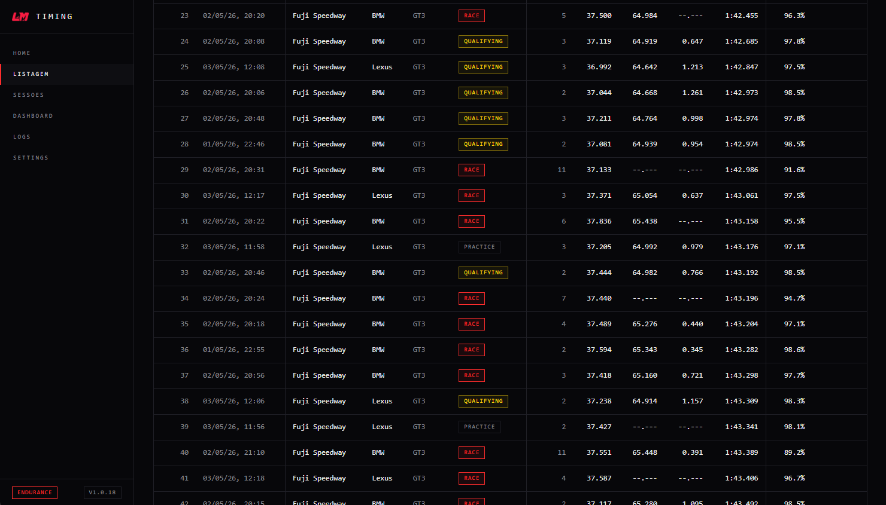

  

<h1 align="center">LMU Desktop</h1>

  Lap telemetry recorder and analyzer for Le Mans Ultimate.

  

---

LMU Desktop records every lap you drive in Le Mans Ultimate and lets you compare them in detail. Lap times, sectors, fuel, tire wear, throttle, brake, steering, gear, position — all captured automatically and stored locally on your machine.

## What it does

- **Records every session.** Open the app, drive, close. Lap times, sectors, fuel use and tire wear are saved automatically.
- **Compares two laps side by side.** Pick a reference lap and overlay deltas, speed, throttle, brake, steering and gear over distance.
- **Replays laps in 2D and 3D.** Watch your lap race against a reference, top-down or in chase camera.
- **Aggregates across sessions.** See your fastest laps per track, per car class, all-time.
- **All local, no account.** No cloud uploads, no telemetry sent anywhere. Your data stays on your machine.

## Install

Download the latest installer from the [Releases](../../releases) page and run it. That's it.

The app opens automatically after install. Open Le Mans Ultimate, drive a lap, and it appears in the session view.

## Usage

### Session overview

After every completed lap, the session view shows your times, sectors, validity, fuel and tire wear. Best lap and consistency (σ) are highlighted at the top.

### Telemetry comparison

Pick any two laps — from the same session or any historical lap on that track — and the app overlays them: delta over distance, speed, throttle, brake, steering, gear. Hover any chart and the position is highlighted on the track map.

### 2D and 3D replay

Watch two laps race against each other. 2D top-down for racing line analysis, 3D chase camera for a more visual feel.

### Track records

Browse your fastest laps per track and per car class across all your sessions.

## Sharing laps

Export any lap to JSON from the session view (`⎘` button). Send it to a friend — they import it and can compare against their own laps as a reference.

## Requirements

- Windows 10 or 11 (x64)
- Le Mans Ultimate

No game-side configuration needed. The app reads from the rFactor 2 shared memory that LMU exposes by default.

## Privacy

Everything stays on your machine.

- Laps and sessions: SQLite database at `%APPDATA%\lmu-desktop\`
- Settings: `%APPDATA%\lmu-desktop\config.json`

The app makes no network requests other than checking for updates from the GitHub releases page.

## License

MIT
